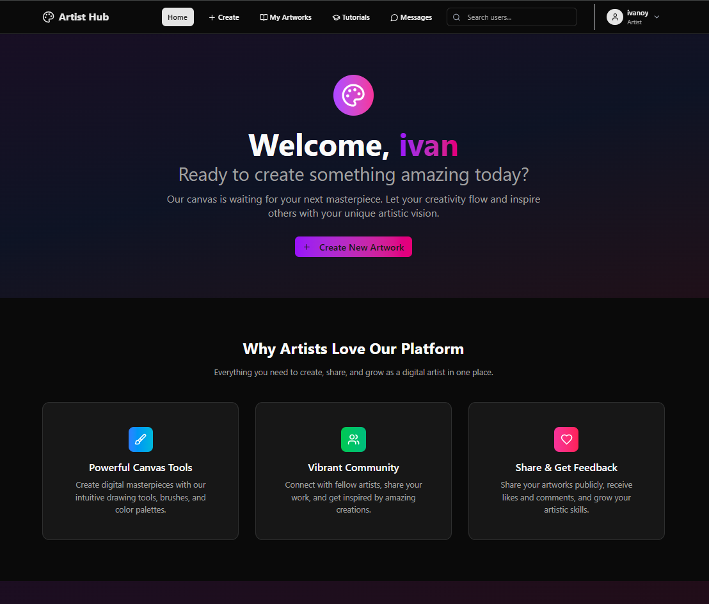
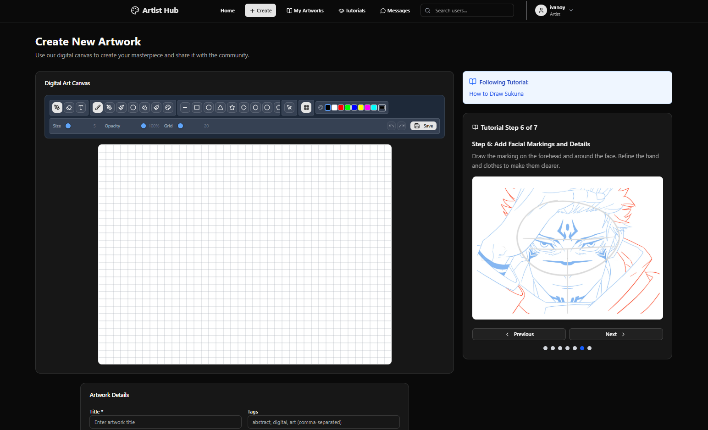

# ArtCaps - Digital Art Platform

## Home


## Playground


A full-stack web application that enables users to create, share, and discover digital artwork with an integrated learning platform.

## Overview

ArtCaps is a comprehensive digital art platform featuring:
- **Digital Canvas**: Browser-based drawing tools with brushes, shapes, and layers
- **Art Sharing**: Community platform for showcasing and discovering artwork
- **Learning Hub**: Interactive tutorials and skill progression system
- **Social Features**: Following, likes, comments, and real-time messaging
- **Admin Dashboard**: Content moderation and user management tools

## Technology Stack

### Backend
- **Runtime**: Node.js with Express.js
- **Database**: MongoDB with Mongoose ODM
- **Authentication**: JWT tokens with bcrypt password hashing
- **Real-time**: Socket.IO for live messaging and notifications
- **File Upload**: Multer for image handling

### Frontend
- **Framework**: React 19 with React Router
- **Styling**: Tailwind CSS with Radix UI components
- **Build Tool**: Vite
- **State Management**: Context API for authentication and themes
- **Maps**: Leaflet for location-based features

## Key Features

### Art Creation
- HTML5 Canvas-based drawing interface
- Multiple brush types and tools (pencil, brush, eraser, shapes)
- Color palette and size controls
- Save/load artwork functionality
- Responsive canvas that adapts to screen size

### Community Platform
- User profiles with follower/following system
- Artwork feed with like and comment functionality
- Search and filter capabilities
- Skill level tracking (beginner, intermediate, advanced)

### Learning System
- Step-by-step tutorials with progress tracking
- Category-based learning paths
- Achievement system with level progression
- Video and text-based content support

### Administration
- User management and moderation tools
- Content approval workflows
- Analytics and reporting dashboard
- Tutorial content management

## Getting Started

### Prerequisites
- Node.js (v16 or higher)
- MongoDB database
- npm or yarn package manager

### Installation

1. **Clone the repository**
   ```bash
   git clone <repository-url>
   cd artCaps1
   ```

2. **Backend Setup**
   ```bash
   cd backend
   npm install
   ```
   
   Create `.env` file:
   ```
   MONGO_URI=mongodb://localhost:27017/artcaps
   JWT_SECRET=your-secret-key
   PORT=5000
   ```

3. **Frontend Setup**
   ```bash
   cd frontend
   npm install
   ```

4. **Start Development Servers**
   ```bash
   # Backend (from backend directory)
   npm run dev

   # Frontend (from frontend directory)
   npm run dev
   ```

The application will be available at `http://localhost:5173` (frontend) and `http://localhost:5000` (backend).

## Project Structure

```
artCaps1/
├── backend/                 # Node.js/Express API
│   ├── controllers/         # Route handlers
│   ├── models/             # MongoDB schemas
│   ├── routes/             # API endpoints
│   ├── middlewares/        # Authentication & logging
│   ├── uploads/            # File storage
│   └── server.js           # Main server file
├── frontend/               # React application
│   ├── src/
│   │   ├── components/     # Reusable UI components
│   │   ├── pages/          # Route pages
│   │   ├── contexts/       # Global state management
│   │   └── utils/          # Helper functions
│   └── public/             # Static assets
```

## API Documentation

The backend provides RESTful APIs for:
- Authentication (`/api/auth`)
- Artworks (`/api/artworks`)
- Users (`/api/users`)
- Tutorials (`/api/tutorials`)
- Comments (`/api/comments`)
- Real-time messaging (`/api/chat`)

See `backend/docs/API_RESPONSES.md` for detailed response formats.

## Contributing

1. Fork the repository
2. Create a feature branch
3. Make your changes
4. Test thoroughly
5. Submit a pull request

## Author

Created by Rhey Ranido

## License

This project is licensed under the MIT License.

```
MIT License

Copyright (c) 2024 Rhey Ranido

Permission is hereby granted, free of charge, to any person obtaining a copy
of this software and associated documentation files (the "Software"), to deal
in the Software without restriction, including without limitation the rights
to use, copy, modify, merge, publish, distribute, sublicense, and/or sell
copies of the Software, and to permit persons to whom the Software is
furnished to do so, subject to the following conditions:

The above copyright notice and this permission notice shall be included in all
copies or substantial portions of the Software.

THE SOFTWARE IS PROVIDED "AS IS", WITHOUT WARRANTY OF ANY KIND, EXPRESS OR
IMPLIED, INCLUDING BUT NOT LIMITED TO THE WARRANTIES OF MERCHANTABILITY,
FITNESS FOR A PARTICULAR PURPOSE AND NONINFRINGEMENT. IN NO EVENT SHALL THE
AUTHORS OR COPYRIGHT HOLDERS BE LIABLE FOR ANY CLAIM, DAMAGES OR OTHER
LIABILITY, WHETHER IN AN ACTION OF CONTRACT, TORT OR OTHERWISE, ARISING FROM,
OUT OF OR IN CONNECTION WITH THE SOFTWARE OR THE USE OR OTHER DEALINGS IN THE
SOFTWARE.
```